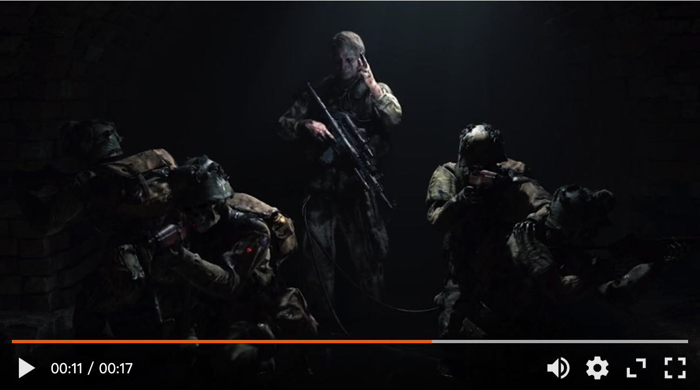

<div align="center">
  <a href="https://github.com/vortesnail/qier-player">
   
  </a>
  <h4>qier-player</h4>
  <br>
	<a href="https://www.npmjs.com/package/qier-player">
		
	</a>
	<a href="https://unpkg.com/qier-player@latest/dist/umd/index.min.js">
		
	</a>
	<a href="https://app.codacy.com/project/badge/Grade/042def878d8f49039cd4cde757fa1e5c">
		
	</a>
</div>

<div align="center">
   <a href="https://github.com/vortesnail/qier-player/blob/master/README.md">
    English
  </a>
  &#124; 简体中文
</div>

## 介绍

`qier-player` 简单易用的 h5 视频播放器，UI 高度可定制化且功能丰富。

## 截图

<div align="center">
  
</div>

## 快速开始

### 安装

npm 包安装:

```bash
npm install --save qier-player
# 或
yarn add qier-player
```

当然你也可以使用 CDN 服务：

```html
<script src="https://unpkg.com/qier-player@latest/dist/umd/index.min.js"></script>
```

### 使用

```js
import Player from 'qier-player';

const player = new Player({
  src: 'https://vortesnail.github.io/qier-player-demo/static/media/video480p.d116ba09.mp4',
});
player.mount('#app');
```

## 生态

| Name | version | gzip size |
| --- | --- | --- |
| [qier-player-for-react]() | [](https://www.npmjs.com/package/@qier-player/react) | [](https://unpkg.com/@qier-player/react@2.0.1/dist/umd/index.min.js) |

## Future features

- `@qier-player/vue` for Vue developer.
- `@qier-player/danmaku` plungin.
